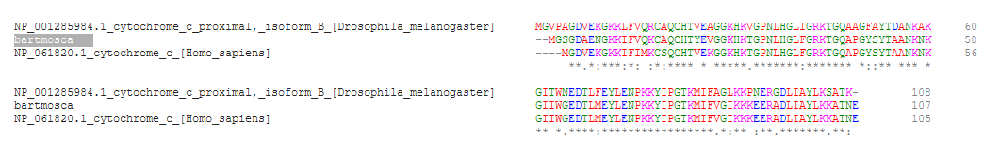

# TP_Bioinformatica

## RETO I: Detalla las tácticas y/o metodologías que deberían utilizarse para darles una respuesta a los padres del niño.

Lo primero que habría que hacer es saber que predominancia tiene este humano-mosca, si es mas mosca que humano o vice versa. Para ello necesitamos comparar las secuencias de humano, mosca y humano-mosca. Pero antes que hacer eso es necesario que estén alineadas todas las secuencias, para ello utilizaremos la herramienta de CLUSTAL para alinear las mismas, una vez hecho esto llevamos las secuencias alineadas a otro programa IQTREE para saber el arbol de esta nueva criatura. Podríamos parar ahí y mostrarle a los padres este nuevo arbol con tres muestras nada mas e inferir que si esta del lado del humano/mosca es de donde tiene predominancia pero este resultado no seria tan preciso como para calmar a una pareja de padres enfurecidos con la ciencia. Para ampliar el resultado y que sea de mayor calidad es necesario agregar mas secuencias a al arbol, siguendo paso a paso las acciones que tuvimos que hacer para todas las secuencias (Alinearlas -> llevarlas al IQTREE junto al resto)

## RETO II: Como vimos anteriormente existen algunos softwares optimizados para confeccionar alineamientos de secuencias. En particular hemos trabajado con Clustal (Larkin et al. 2007). Confecciona los alineamientos para los del punto Ia y Ib análisis.

